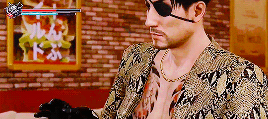

<h1 align="center">🌟 About Me 🌟</h1>

  Adrien Newman 
  Self-Taught | Fullstack Developer | Digital Artist

 

  

- 🔭 I’m currently working on **The Odin Project's final project "Odin Book"**
- 🌱 I’m currently learning **how to polish my front-end design skills**
- 👯 I’m looking to collaborate on **unique Open Source projects**
- 💬 Ask me about **how I design apps with user functionality in mind**
- 📫 Reach me at **adriennewman92@gmail.com**
- 🐍 **Fun fact:** The character featured in my icon and most of my project READMEs is Sega's Majima Gorō from the Yakuza/Like A Dragon series

## Project Highlights
   <!-- messaging app -->
   <!-- where's waldo -->
   <!-- inventory application -->
   <!-- battleship -->

## Contact
   <!-- email -->
   <!-- TODO: personal website -->
  [")](https://github.com/MK-DlR) <!-- github -->
   <!-- linkedin -->
   <!-- bsky -->
   <!-- twitter -->

## Languages & Tools
   <!-- express -->
   <!-- javascript -->
   <!-- nodejs -->
   <!-- postgresql -->
   <!-- prisma -->
   <!-- react -->
   <!-- vite -->

  

  Icons by <a target="_blank" href="https://icons8.com">Icons8</a>

